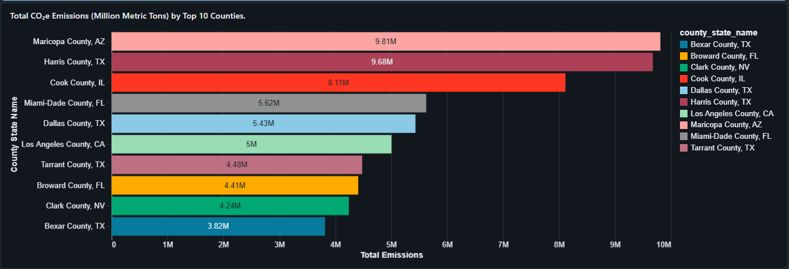

## Dashboard Overview

**Description:**  
This bar chart displays the total greenhouse gas emissions (million metric tons of CO₂e) for the top 10 emitting counties in the United States.

## Emissions Hotspot Map

**Description:**  
This map highlights the top 1,000 greenhouse gas–emitting locations in the United States. Locations are colored by emission intensity and sized according to total CO₂e emissions, emphasizing geographic emission hotspots.

## Population vs. Emissions and Top 10 States

**Description:**  
The scatter plot illustrates the relationship between population size and per-capita emissions, showing that higher-population areas tend to have lower emissions per person. The accompanying pie chart shows that the top 10 U.S. states collectively account for 51% of total greenhouse gas emissions in the United States.

