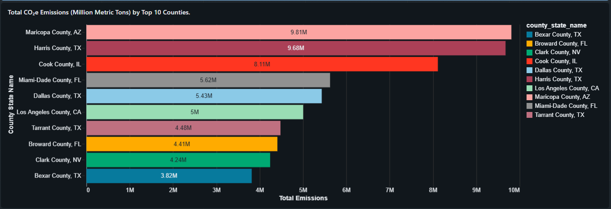
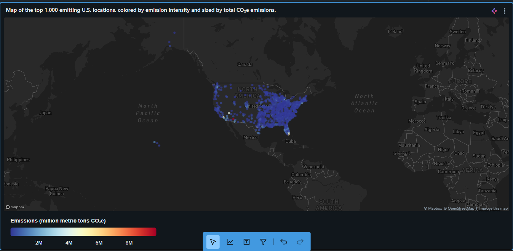
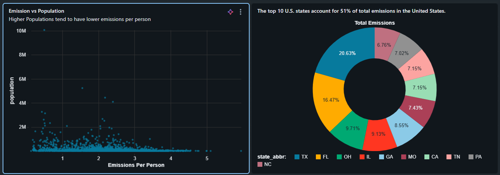

# U.S. Greenhouse Gas Emissions Analysis

An interactive emissions analytics dashboard built in **Databricks Lakeview**, visualizing greenhouse gas emissions across U.S. counties and states using geospatial and statistical analysis.

---

## Live Dashboard

The dashboard was built in Databricks Lakeview. Due to workspace security restrictions, access requires a Databricks account.

🔗 [View Databricks Dashboard](https://dbc-0108387a-f81b.cloud.databricks.com/dashboardsv3/01f0e50a17d2196e91e74601c52abfea/published?o=368433980168844)

> **Note:** For reviewers without Databricks access, screenshots below show the full dashboard functionality.

---

## Dashboard Preview

### Top 10 Emitting Counties: Bar Chart

Total greenhouse gas emissions (in million metric tons of CO₂e) for the top 10 emitting countries in the United States.

---

### Emissions Hotspot Map

The top 1,000 greenhouse gas–emitting locations in the United States. Locations are colored by emission intensity and sized by total CO₂e emissions, highlighting geographic hotspots.

---

### Population vs. Emissions & Top 10 States

The scatter plot shows the relationship between population size and per-capita emissions. Areas with larger populations tend to have lower per-capita emissions. The pie chart shows that the top 10 U.S. states account for **51% of total national greenhouse gas emissions**.

---

## Technologies Used

| Tool | Purpose |
|---|---|
| Databricks | Platform |
| Databricks Lakeview | Dashboard development |
| PySpark / Spark SQL | Data processing and analytics |
